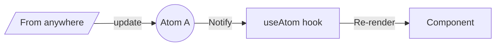
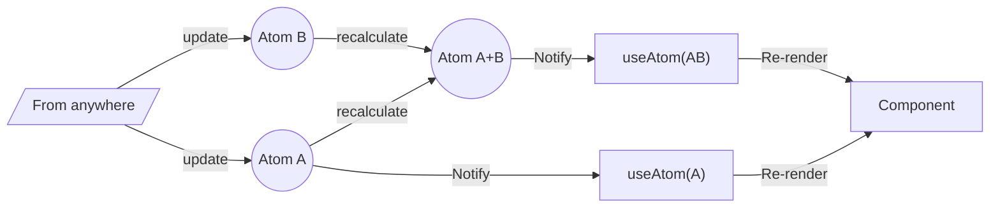

# REACT ATOM
A state management library for React, follows bottom-up model ( similar with Jotai ), simple, zero-boilerplate setup, not depend to React framework ( can be used without React ). Basically you can easily define a piece of reactive data ( ATOM ) and use them anywhere in your React application, you can even compose multipe ATOMs to create another ATOM ( ATOM composition ). React-atom also include advance features like selector/piping for even more flexibility...
## Install
npm i reactive-atom
## Examples

### Basic usage


```code
const atomA = new Atom<number>(1);

const Component = () => {
	const [a, setA] = useAtom(atomA);
	return <div>  
		a = {a}  
		<button onClick={() => {  
			setA(a+1);  
		}}>  
			Increase a  
		</button>  
	</div>
}
```

### Compose Atom

```code
export const atomA = new Atom<number>(1);  
export const atomB = new Atom<number>(2);
const defaultSelector = a => a;
  
export const atomAB = new ComposeAtom<number>(  
	[atomA, atomB],  
	[defaultSelector, defaultSelector],  
	(a: number, b: number) => {  
		console.log("calculate A + B");  
		return a + b;  
	},  
);
```
### useAtom with selector
Waiting for document...
### Batching multiple updates on atom
Waiting for document...
### Batching multiple recalculate on compose atom
Waiting for document...
### Piping atom data with RXJS
Waiting for document...
